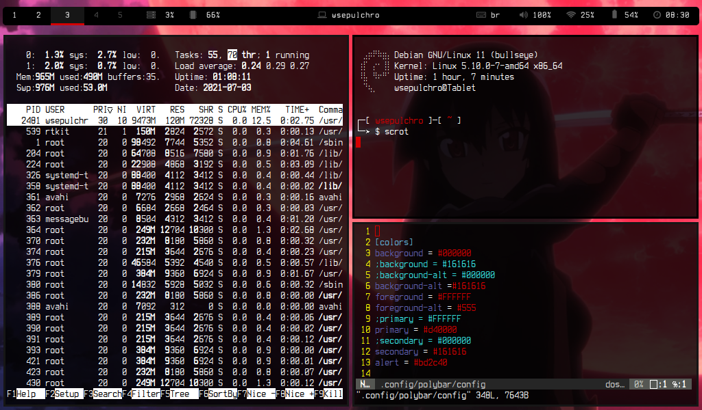
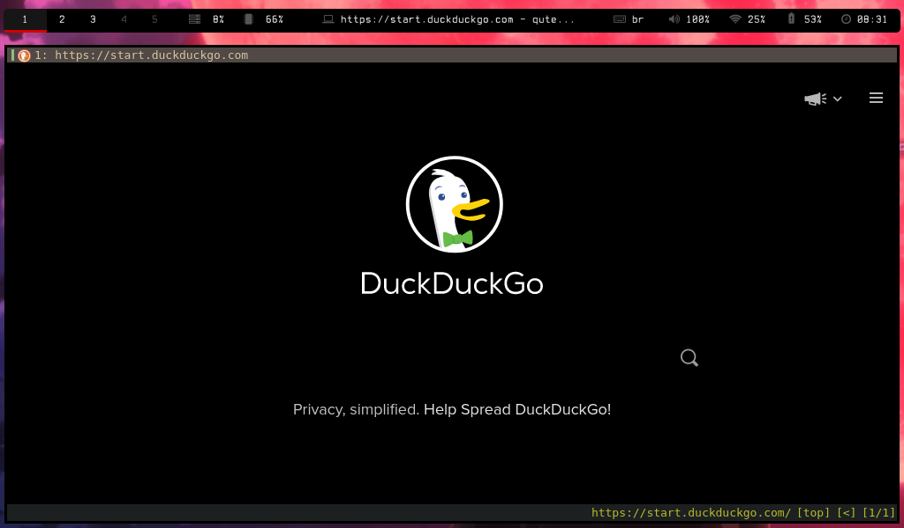
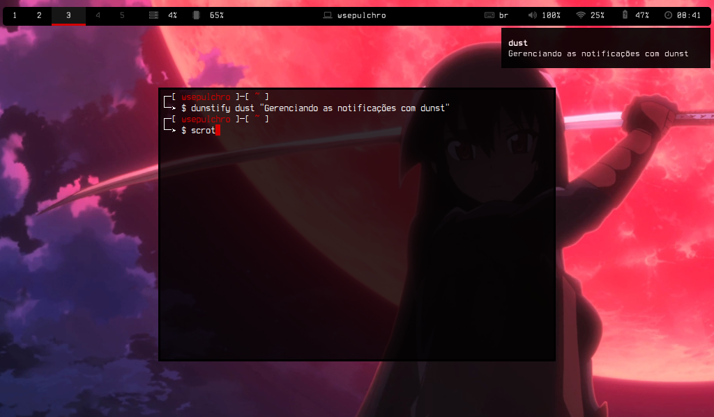

# dotfiles

Arquivos de configuração do meu desktop minimalista:

## Distribuição: Debian netinstall

- **BSPWM**

- Notificações: Dunst

- Polybar

- Emulador de terminal: RXVT Unicode

- BASH

- Gerenciador de arquivos: Ranger

- Navegador QuteBrowser

- vim

